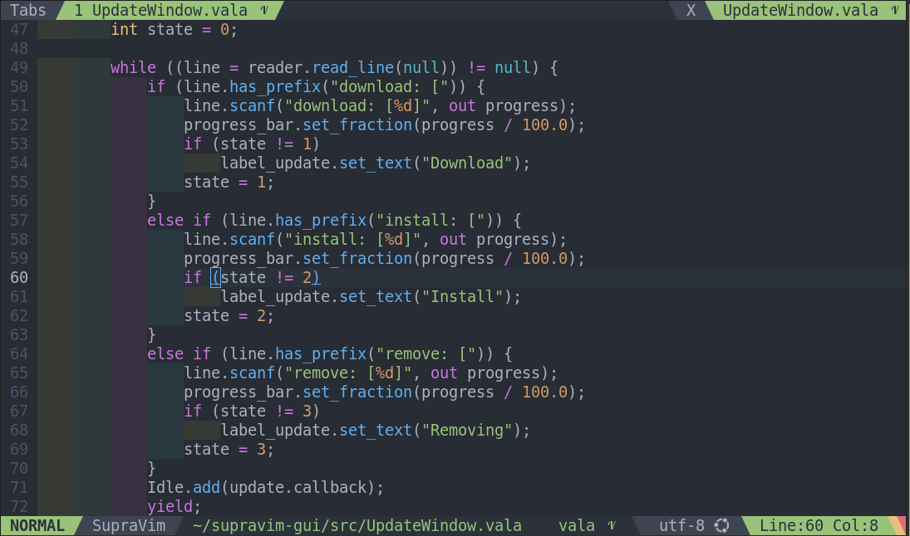

# indent_rainbow 🌈

Un plugin Vim9script pour mettre en valeur les indentations avec des couleurs alternées, facilitant la lecture du code.

## Configuration

Le plugin propose plusieurs options de personnalisation :

- `g:sp_indent_rainbow_color_1` : première couleur pour l’indentation (par défaut : `FFFF40`)
- `g:sp_indent_rainbow_color_2` : deuxième couleur pour l’indentation (par défaut : `7FFF7F`)
- `g:sp_indent_rainbow_color_3` : troisième couleur pour l’indentation (par défaut : `FF7FFF`)
- `g:sp_indent_rainbow_color_4` : quatrième couleur pour l’indentation (par défaut : `4FECEC`)
- `g:sp_indent_rainbow_opacity` : opacité des couleurs (de 0 à 100, par défaut : `7`)

## Fonctionnement

Chaque niveau d’indentation est coloré en alternance avec les couleurs définies, ce qui améliore la lisibilité du code.
