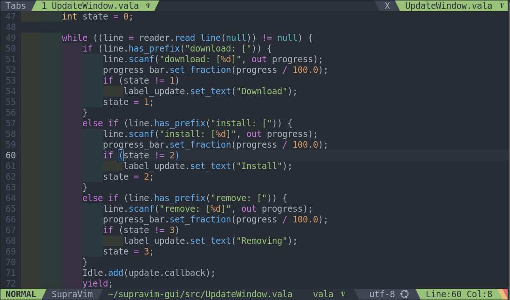

# indent_rainbow 🌈

A Vim9script plugin to highlight indentations with alternating colors, making code easier to read.

## Configuration

The plugin provides several customization options:

- `g:sp_indent_rainbow_color_1`: first color for indentation (default: `FFFF40`)
- `g:sp_indent_rainbow_color_2`: second color for indentation (default: `7FFF7F`)
- `g:sp_indent_rainbow_color_3`: third color for indentation (default: `FF7FFF`)
- `g:sp_indent_rainbow_color_4`: fourth color for indentation (default: `4FECEC`)
- `g:sp_indent_rainbow_opacity`: opacity of the colors (from 0 to 100, default: `7`)

## How it works

Each indentation level is colored alternately using the defined colors, improving code readability.
